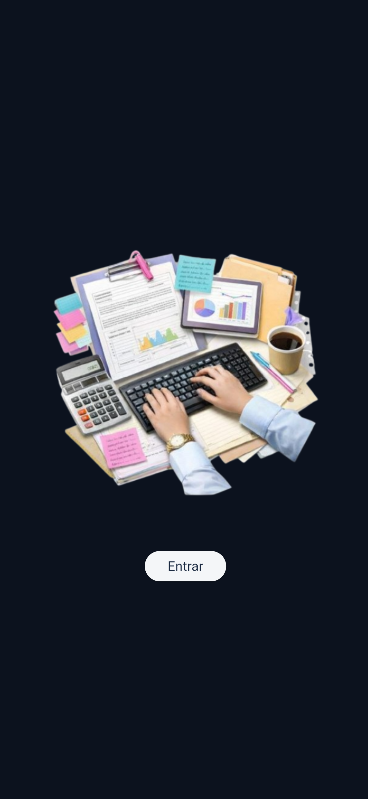
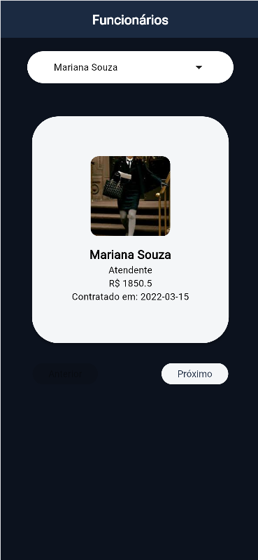
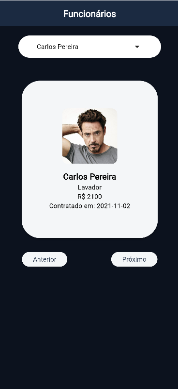
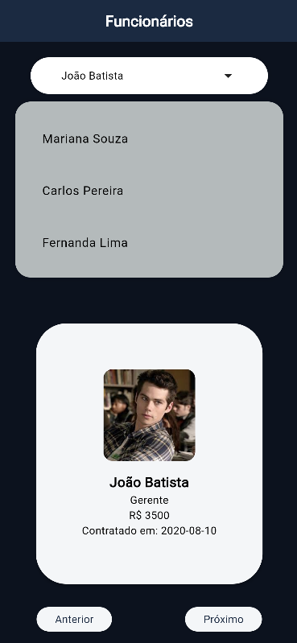

<div align="center">

# 👥 Funcionários


</div>

---

## Sobre

Aplicativo mobile desenvolvido para praticar desenvolvimento com **Flutter**, criado durante o curso técnico em **Desenvolvimento de Sistemas** no **SENAI**.

---

## 📸 Telas

<div align="center">

| | | | |
|:---:|:---:|:---:|:---:|
|  |  |  |  |

</div>

## 🛠 Tecnologias

- [Flutter](https://flutter.dev/)
- [Dart](https://dart.dev/)
- Android / iOS

---

## ▶️ Como rodar

```bash
# Clone o repositório
git clone https://github.com/IsabelleBorges26/SENAI_2026.git

# Instale as dependências
flutter pub get

# Execute
flutter run
```

---

## 👩‍💻 Desenvolvedora

**Isabelle Borges** 
